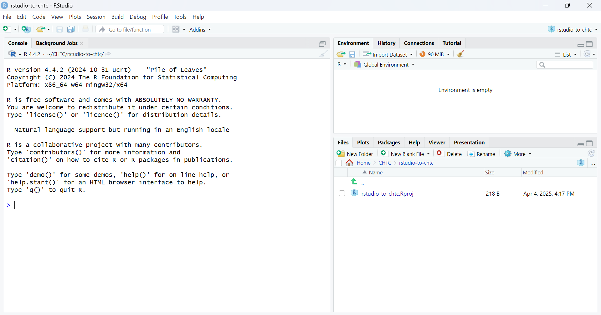
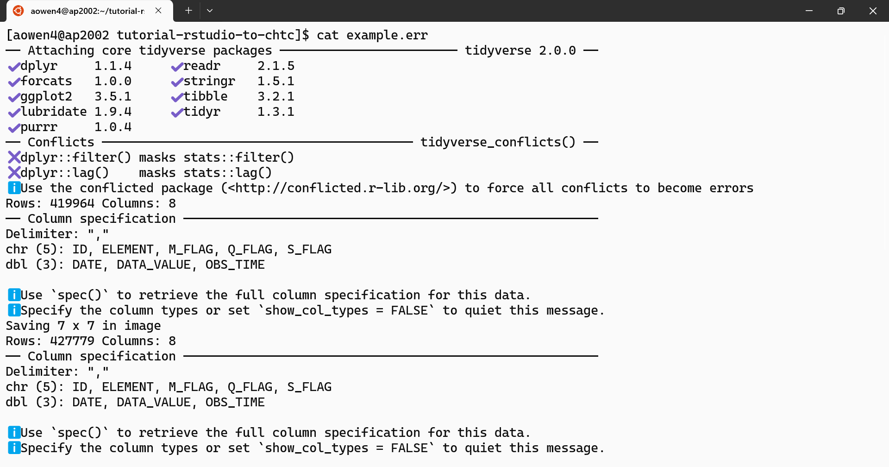

# Long-Read Genomics on the OSPool

This is a start-to-finish tutorial for how to deploy and run R calculations on CHTC's High Throughput Computing (HTC) system.
The goal of this tutorial is to provide a step-by-step example of how to go from running R calculations on your computer using RStudio,
to running *many* such calculations on a High Throughput Computing system.

Using data from the [NOAA Global Historical Climatology Network](https://www.ncei.noaa.gov/metadata/geoportal/rest/metadata/item/gov.noaa.ncdc:C00861/html),
this tutorial generates histograms showing the distribution of daily high and low temperatures across the four meteorological seasons.

Jump to...

- [Tutorial Setup](#tutorial-setup)
- [Example Calculation Using RStudio](#example-calculation-using-rstudio)
- [Transitioning from RStudio](#transitioning-from-rstudio)
- [Logging into CHTC](#logging-into-chtc)
- [Run Example Calculation as a Single Job](#run-example-calculation-as-a-single-job)
- [Run Example Calculation as Multiple Jobs](#run-example-calculation-as-multiple-jobs)
- [Next Steps](#next-steps)
- [Getting Help](#getting-help)
- [Appendix](#appendix-preparing-to-transition-an-r-project-from-your-computer-to-chtc)

## Tutorial Setup

### Assumptions

This tutorial assumes that you have been using R via the RStudio program installed on your computer.
To participate in the hands-on portion, you'll need an active CHTC account.
You can request such an account here: [go.wisc.edu/chtc-account](https://go.wisc.edu/chtc-account).
To make it easier to copy and paste commands, we recommend that you have this tutorial's GitHub page open in your browser.

> [!TIP]
> It is recommended, though not required, that you complete the "Hello World" guide [Practice: Submit HTC Jobs using HTCondor](https://chtc.cs.wisc.edu/uw-research-computing/htcondor-job-submission) before starting this tutorial.

### Materials

To obtain a copy of the files used in this tutorial, you can

* Clone the repository, with 
  
  ```
  git clone https://github.com/osg-htc/tutorial-long-read-genomics
  ```

  or the equivalent for your device

* Download the zip file of the materials: 
  [download here](https://github.com/CHTC/tutorial-rstudio-to-chtc/archive/refs/heads/main.zip)

We recommend that you create a new R project named "rstudio-to-chtc" and download/copy the files into that directory.

In the RStudio toolbar,

## Basecalling Oxford Nanopore long reads using Dorado

### Setting up our software environment
Before we can begin basecalling our reads, we need to setup our software environment to run Dorado. We are going to setup
our environment using an Apptainer container. 

1. First, let's login to our OSPool Account

    ```
    ssh user.name@ap40.uw.osg-htc.org
    ```

2. Run the following commands on the Access Point (AP) to set our temporary apptainer build directory to `/home/tmp/`.
Once you've built your container, you can delete the contents of this directory to reduce quota usage on `/home`. 

    ```
    mkdir -p $HOME/tmp
    export TMPDIR=$HOME/tmp
    export APPTAINER_TMPDIR=$HOME/tmp
    export APPTAINER_CACHEDIR=$HOME/tmp
    ```

3. We now need to write up a definition file for singularity to build our Dorado container. Copy and paste this block of
text to a new file titled `dorado.def`. You can open up a text editor, such as `vim` or `nano` using a command like: `vim dorado.def`.

    ```
    Bootstrap: docker
    From: nvidia/cuda:12.8.1-cudnn-devel-ubuntu24.04
    
    %post
        DEBIAN_FRONTEND=noninteractive
    
        # system packages
        apt-get update -y
        apt-get install -y \
                build-essential \
                wget
    
        apt install -y python3-pip
       
        # install Dorado and POD5
        cd /opt/
        wget https://cdn.oxfordnanoportal.com/software/analysis/dorado-0.9.5-linux-x64.tar.gz
        tar -zxvf dorado-0.9.5-linux-x64.tar.gz
        rm dorado-0.9.5-linux-x64.tar.gz
        
        # install POD5 using pip
        pip install pod5 --break-system-packages
    
    %environment
    
        # set up environment for when using the container
        # add Dorado to $PATH variable for ease of use
        export PATH="/opt/dorado-0.9.5-linux-x64/bin/:$PATH"
    ```

    This definition file uses the Nvidia CUDA Ubuntu 24.04 base image and installs necessary packages to run Dorado and POD5
    on our data.


4. Build your apptainer container on the Access Point (AP) by running the following command:
    ```
    apptainer build dorado.sif dorado.def
   ```
   
5. Move your finalized container image `dorado.sif` to your `OSDF` directory
    
    ```
   mv dorado.sif /ospool/ap40/data/<user.name>/
   ```

### Data Wrangling and Splitting Reads

Oxford Nanopore sequencing runs general yield POD5 files. Each POD5 file is generated about once an hour throughout the
duration of the sequencing run. This output format does not scale very well, as data output usually plateus after 24-48hrs.
This would mean that POD5 files that are generated from earlier in the sequencing run, will be larger in size compared to
files later in the run. Additionally, this division of data does not allow for _Duplex_ read basecalling. As a result prior
to running Dorado, we must first reorganize the data contained within all the POD5 files. 

#### For _Simplex_ basecalling
When basecalling our sequencing data using simplex basecalling mode on Dorado we can subdivide our POD5 files into smaller individual subsets. This subdivision of our files enables us to take advantage of the OSPool's High Throughput Computing (HTC) principles, significantly decreasing the time-to-results for our basecalling. We will use the `POD5` package installed in our `dorado.sif` container—if you need to generate the `dorado.sif` apptainer image, refer to [Setting up our software environment](#Setting-up-our-software-environment). 

1. Create a csv that maps reads in your `pod5_dir` to subset files.
    ```
    pod5 view <path_to_pod5_dir> --include "read_id" | awk 'NR==1 {print "read_id subset_id"; next} {print $0, int((NR-1)/1000)}' > read_subsets.csv
   ```
   _This will generate a CSV table mapping each read_id to a subset_file for basecalling._


2. Using the `read_subsets.csv` mapping file, subset your POD5 reads to the output directory `split_pod5_subsets`
    ```
   pod5 subset <path_to_pod5_dir> --summary read_subsets.csv --columns subset_id --output split_pod5_subsets
   ```
   
3. Create a list of POD5 files to iterate through while basecalling

    ```
   ls split_pod5_subsets > /home/<user.name>/genomics_tutorial/pod5_files
   ```
   
    If you `head` this new file you should see an output similar to this:

    ```
    [user.name@ap40 user.name]$ head /home/<user.name>/genomics_tutorial/pod5_files
    subset_id-0.pod5
    subset_id-100.pod5
    subset_id-101.pod5
    subset_id-102.pod5
    subset_id-103.pod5
    subset_id-104.pod5
    subset_id-105.pod5
    subset_id-106.pod5
    subset_id-107.pod5
    subset_id-108.pod5
    [user.name@ap40 user.name]$ 
   ```

----

#### For _Duplex_ basecalling
When basecalling our sequencing data using simplex basecalling mode on Dorado we can subdivide our POD5 files into smaller individual subsets. This subdivision of our files enables us to take advantage of the OSPool's High Throughput Computing (HTC) principles, significantly decreasing the time-to-results for our basecalling. We will use the `POD5` package installed in our `dorado.sif` container—if you need to generate the `dorado.sif` apptainer image, refer to [Setting up our software environment](#Setting-up-our-software-environment). 

1. Create a csv that maps reads in your `pod5_dir` to subset files.
    ```
    pod5 view <path_to_pod5_dir> --include "read_id, channel" --output summary.tsv
   ```
   _This will generate a TSV table mapping each read_id to each channel for basecalling._

2. Using the `read_subsets.csv` mapping file, subset your POD5 reads to the output directory `split_pod5_subsets`
    ```
   pod5 subset <path_to_pod5_dir> --summary summary.tsv --columns channel --output split_pod5_subsets
   ```
   
3. Create a list of POD5 files to iterate through while basecalling

    ```
   ls split_pod5_subsets > /home/<user.name>/genomics_tutorial/pod5_files
   ```
   
    If you `head` this new file you should see an output similar to this:

    ```
    [user.name@ap40 user.name]$ head /home/<user.name>/genomics_tutorial/pod5_files
    channel-100.pod5
    channel-101.pod5
    channel-102.pod5
    channel-103.pod5
    channel-104.pod5
    channel-105.pod5
    channel-106.pod5
    channel-107.pod5
    channel-108.pod5
    channel-109.pod5
    [user.name@ap40 user.name]$ 
   ```

### Submitting your basecalling jobs


1. Create your Dorado simplex basecalling executable - `/home/<user.name>/genomics_tutorial/executables/basecalling_step2_simplex_reads.sh`

    ```
    # Run Dorado on the EP for each POD5 file (non-resumeable)
    #dorado ${dorado_arg_string} ${input_pod5_file} > ${output_bam_file}
    echo "Running dorado with: $1"
    
    # untar your Dorado basecalling models
    tar -xvzf models.tar.gz
    rm models.tar.gz
    echo "completed tar unzip"
    
    args="$1"
    eval "dorado $args"
   ```

2. Create your submit file for Dorado simplex basecalling - `/home/<user.name>/genomics_tutorial/submit_files/basecalling_step2_simplex_reads.sub`

    ```
    +SingularityImage      = "osdf:///ospool/ap40/data/<user.name>/dorado.sif"

    executable		       = ../executables/basecalling_step2_simplex_reads.sh
    arguments		       = "'basecaller --batchsize 16 hac@v5.0.0 --models-directory ./models/ $(POD5_input_file) > $(POD5_input_file).bam'"
    
    transfer_input_files   = osdf:///ospool/ap40/data/daniel.morales/split_by_channels/$(POD5_input_file), osdf:///ospool/ap40/data/daniel.morales/models.tar.gz

    transfer_output_files  = ./$(POD5_input_file).bam
    output_destination	   = osdf:///ospool/ap40/data/daniel.morales/basecalledBAMs/
    
    output                 = ./basecalling_step2/logs/$(POD5_input_file)_$(Process)_basecalling_step2.out
    error                  = ./basecalling_step2/logs/$(POD5_input_file)_$(Process)_basecalling_step2.err
    log                    = ./basecalling_step2/logs/$(POD5_input_file)_$(Process)_basecalling_step2.log
    
    request_cpus           = 1
    request_disk           = 8 GB
    request_memory         = 24 GB 
    request_gpus		   = 1
    
    queue POD5_input_file from /home/<user.name>/genomics_tutorial/pod5_files
   ```

This submit file will read the contents of `/home/<user.name>/genomics_tutorial/pod5_files`, iterate through each line, and assign the value of each line to the variable `$POD5_input_file`. This allows to us programmatically submit _N_ jobs, where _N_ is equal to the number of POD5 subset file we created previously. Each job will have its corresponding POD5 input subset (`subset_id-105.pod5`) and `models.tar.gz` files transferred to the Execution Point (EP). Additionally, we will transfer and start our `dorado.sif` apptainer container image using the `+SingularityImage` attribute on our submit file. 

The submit file will instruct the EP to run our executable `basecalling_step2_simplex_reads.sh` and pass the arguments found in the `arguments` attribute. The `arguments` attribute allows us to customize the parameters passed to _Dorado_ directly on our submit file, without having to edit our executable. 

> [!NOTE]  
> The example submit script above is running the hac@v5.0.0 model for simplex basecalling. You can change this to `duplex sup --models-directory ./models/ $(POD5_input_file) > $(POD5_input_file).bam'`. For additional usage information, refer to the [Dorado User Documentation](https://github.com/nanoporetech/dorado).

3. Submit your set of basecalling jobs

    ```
   condor_submit basecalling_step2_simplex_reads.sub
   ```
   
    You can track the progress of your jobs with the `condor_q` command
    
    > [!NOTE] 
    > You may experience some `held` jobs due to a variety of resource allocation overruns, including using more memory or CPUs than request. We recommend you use the following commands to edit those held jobs and resubmit them. 
    >
    > ```
    > [user.name@ap40 user.name]$ condor_q <cluster.id> -hold
    > 12345678.123      user.name       5/6  19:47 Excessive CPU usage. Job used 3 CPUs, while request_cpus=1. Please verify that the code is configured to use a limited number of cpus/threads, and matches request_cpus.
    > [user.name@ap40 user.name]$ condor_qedit 12345678.123 requestCpus=4
    > [user.name@ap40 user.name]$ condor_release 12345678.123
    > Job 12345678.123 released
    > [user.name@ap40 user.name]$ 
    > ```

---------


1. Click on "File", then "New Project"
   
   

2. Click on "New Directory"
   
   

3. Click on the "New project" type

   

   After you click the "Create Project" button, RStudio will load the project environment.
   In the "Files" pane, you'll see the file `rstudio-to-chtc.Rproj` along with the files you downloaded.

4. Enter `rstudio-to-chtc` as the "Directory name". 
   Choose a parent directory that you feel is appropriate.
   Whether to check the box for "Use renv with this project" is up to you.

   

5. Click the "Create Project" button. This will create an empty project as requested.

   

5. Download/copy tutorial files into the empty project.
   When you are done, it should look like the following:

   
   You may need to press the refresh button to reload your `Files` panel

## Example Calculation Using RStudio

This tutorial provides some example scripts for analyzing data from the [NOAA Global Historical Climatology Network](https://www.ncei.noaa.gov/metadata/geoportal/rest/metadata/item/gov.noaa.ncdc:C00861/html).

As you read and follow the instructions for running the example calculation, keep note of the 
things that you needed to set up in order to make the calculation work.

Later on, you will need to think about the same things in order to run the calculation on CHTC.

### Installing required packages in RStudio

The example calculation requires that the R package "tidyverse" is installed.

To install the necessary package, run the following command in the R Console:

```
install.packages("tidyverse")
```

You will see a bunch of messages printed to the console screen about R installing the package you specified.
If you have not installed the `tidyverse` package before, it may take a few minutes to install.
Once the command has completed running, you'll see the console prompt symbol again (`>`),
meaning you are ready to run another command.

### Running the example script

In the "Files" pane, double-click on `example.R` to open the script in RStudio. 

This script contains a for-loop that generates a histogram for each of the following stations:

| Filename | Station ID | Station Location |
| --- | --- | --- |
| `madison.csv` | `USW00014837` | WI MADISON DANE CO RGNL AP |
| `milwaukee.csv` | `USW00014839` | WI MILWAUKEE MITCHELL AP |
| `stevens_point.csv` | `USW00004895` | WI STEVENS POINT MUNI AP |

Each iteration of the for-loop does the following:
* Load historic temperature data for a weather station using its ID and the corresponding `.csv` file.
* Extract the temperature data and label them by the meteorological season the measurement was recorded in.
* Create a histogram of comparing the high and low temperatures across the four meteorological seasons.

Open the `example.R` script in the file pane.
Take a few moments to inspect the script to try to understand what it is doing.
When you are ready, execute the script by clicking the "Source" button in the top right of the file pane.


You should see some output messages about the datasets being analyzed.
Once the script has finished running,
there should be three new files ending with `.png` in the file pane,
which are the histograms corresponding to the stations listed in the table above.


## Transitioning from RStudio

Now that you've successfully run the example calculation using RStudio on your computer,
let's consider how to migrate the calculation to work on the High Throughput Computing (HTC) system.

To execute the example calculation, you needed

* The R script `example.R`, which contained the commands you wanted to execute.
* The additional `my_functions.R` and `.csv` station data files, which were read in by the `example.R` script.
* The R console version 4.4.2 with the `tidyverse` package installed, which was the software environment for executing `example.R`.

To run the example calculation on the HTC system, you will need the same set of items:

* The "executable": script containing the commands you want to execute.
* The "input files": additional files needed in order for the "executable" to function.
* The "software environment": programs that are used to run, or are required by, the "executable" script.

To use the "executable" and "input files" on the system, you'll need to first transfer said files from your computer to the HTC system.
For this tutorial, we'll clone the git repository to the system.
But you can also upload files directly from your computer, as described in our guide [Transfer Files between CHTC and your Computer](https://chtc.cs.wisc.edu/uw-research-computing/transfer-files-computer).

The traditional way of handling the "software environment" can be rather complicated.
For most new users, we recommend instead that they use something called a "container".
For now, think of containers as a plug-and-play method for deploying software.

> [!TIP]
> Your R project may be structured differently or may be more extensive than the project in this tutorial.
> For guidance on how to identify the necessary information for migrating your project to CHTC, 
> see the [notes below](#preparing-to-transition-an-r-project-from-your-computer-to-chtc).

## Logging into CHTC

Before proceeding, we need to make sure that you can login to the HTC system. 
Access to CHTC systems is currently only via the command line (aka terminal) using the SSH protocol.

First, open the "Terminal" application on your computer.
> [!NOTE]  
> Mac and Linux operating systems come with a unix "Terminal" application by default.
> Windows 11 comes with a powershell "Terminal" application, but older Windows machines may need to install it manually: [Windows Terminal](https://apps.microsoft.com/detail/9N0DX20HK701?hl=en-us&gl=US&ocid=pdpshare).
> If you are unable to install software on your machine, then you should still be able to use the "PowerShell" or "Cmd" applications instead.

> [!Warning]
> Technically, RStudio comes with a built-in "Terminal" that can be accessed via a tab in the bottom left "Console" pane.
> While you can use that to login to CHTC, we do not recommend it, as it becomes too easy to run commands on the login server that you meant to run on your computer!

You should see something like this (colors, font, and size will likely differ):


Next, you'll enter the following command (with the information unique to your account):

```
ssh yourNetID@hostname
```

where `yourNetID` should be replaced with your actual NetID, and `hostname` should be replaced with the address provided in your account confirmation email. 
For example, if your NetID is `bbadger` and your account is on hostname `ap2002.chtc.wisc.edu` (where most new user accounts are located), 
the command would be `ssh bbadger@ap2002.chtc.wisc.edu`.

> [!NOTE]
> You will need to be on the university internet for the command to work!
> That means you either need to be physically on campus, or else connected to the GlobalProtect VPN (WiscVPN).

The first time you connect to a server via SSH, you will prompted to confirm that you trust the server.
Most of the time, it is okay to enter "yes".

> If you are concerned about the security of your connection to CHTC, please contact a facilitator for more information.

When prompted for your password, enter the same password you use to login with your NetID to other university services, such as MyUW (my.wisc.edu).

Finally, you will be prompted to complete the two-factor authentication using DUO.

After the two-factor authentication has been confirmed, you should be logged in to the HTC system.
A welcome message containing the following should be displayed in your terminal:


There will be some additional information in the welcome message, 
but at the bottom of the screen your terminal prompt should look like

```
[yourNetID@ap2002 ~]$ 
```
> [!TIP]
> For more information on logging in to the system, see [Log in to CHTC](https://chtc.cs.wisc.edu/uw-research-computing/connecting).

### Submitting a Test Job (Optional)

We recommend that all new users work through the "hello world" guide for submitting jobs using HTCondor on the High Throughput Computing cluster:
[Practice: Submit HTC Jobs using HTCondor](https://chtc.cs.wisc.edu/uw-research-computing/htcondor-job-submission).

Doing so is optional, however, for participating in this tutorial.

## Copying Files to CHTC

Once you are logged in, duplicate the tutorial materials to your directory on the HTC system with the following command:

```
git clone https://github.com/CHTC/tutorial-rstudio-to-chtc
```

Now run the command `ls` (lowercase "L" and lowercase "S") to **l**i**s**t the contents of your directory on the HTC system:

```
ls
```

You should see a directory called `tutorial-rstudio-to-chtc`, corresponding to the GitHub repository that you just cloned. 

Next, run the command `cd` followed by the directory name (`tutorial-rstudio-to-chtc`) to **c**hange **d**irectory:

```
cd tutorial-rstudio-to-chtc
```

By running this command, you've changed your location on the server to be inside of the GitHub repository.
Your command prompt typically shows the name of the directory you are located inside;
in this case, you should see

```
[yourNetID@ap2002 ~]$ cd tutorial-rstudio-to-chtc
[yourNetID@ap2002 tutorial-rstudio-to-chtc]$
```

Running the `ls` command here should show you the contents of the GitHub repository for this tutorial.


> [!TIP]
>For more information on how to use the command line, see our guide [Basic shell commands](https://chtc.cs.wisc.edu/uw-research-computing/basic-shell-commands).

## Run Example Calculation as a Single Job

We'll first replicate the execution of the example calculation on the HTC system the same way we ran it in RStudio.
That is, we are not going to change anything about the contents of the `example.R` script.
All that we need to do is create a "submit file" that will describe to HTCondor how to run calculation.

### About the submit file

The submit file describes to HTCondor the calculation (or "job") that we want to submit.
Just like how the `example.R` file describes to R the commands that you want to execute within the R language, 
the submit file describes to HTCondor how it should execute the `example.R` file on a computer within the HTC system.

To start with, the submit file will need to detail the items discussed in [Transitioning from RStudio](#transitioning-from-rstudio):

* The "executable" script, containing the commands you want to execute.

  ```
  executable = example.R
  ```

* The "input files" needed in order for the "executable" to function.

  ```
  transfer_input_files = example.R, my_functions.R, madison.csv, milwaukee.csv, stevens_point.csv
  ```

* The "software environment" with the programs that are used to run, or are required by, the "executable" script.

  ```
  container_image = docker://rocker/tidyverse:4.4.2
  ```

Since you'll be asking HTCondor to execute the calculation on a remote machine, there are a few more items that need to be declared as well:

* A job management "log" for keeping track of HTCondor's actions. 

  ```
  log = example.log
  ```

* Standard "output" and "error" files to record the messages that would normally be printed to your screen.

  ```
  output = example.out
  error = example.err
  ```

* A set of resource "requests" for the amount of computing power that should be used.

  ```
  request_cpus = 1
  request_memory = 2GB
  request_disk = 5GB
  ```

Finally, since HTCondor is designed for high throughput computing, you can define the number of calculations (or jobs) that you want it to run on your behalf.

* The "queue" statement 

  ```
  queue 1
  ```

To create a submit file for our example, we just need to combine all of these lines into one file.
The order of the lines is a matter of preference, with the exception of the `queue` statement - that must always come last.

### Create the submit file

We'll use a command-line text editor to create the submit file.
Run the following command to open a new file called "example.sub":

```
nano example.sub
```

Your terminal will open a blank file into which you can type the contents of a file.
You move the cursor in the file using the arrow keys.
Keyboard shortcuts for other operations are listed at the bottom of the screen, 
where the `^` represents the `Ctrl` (or `Control` on Mac) key
and the `M-` represents the `Alt` (or `Option` on Mac) key.


Copy and paste the following contents into the terminal.
If you are having trouble pasting into the terminal, 
take a few minutes to type the contents in manually. 

```
log = example.log

container_image = docker://rocker/tidyverse:4.4.2

transfer_input_files = example.R, my_functions.R, madison.csv, milwaukee.csv, stevens_point.csv

executable = example.R

output = example.out
error = example.err

request_cpus = 1
request_memory = 2GB
request_disk = 5GB

queue 1
```


To tell `nano` to save the contents of the file, use the `^O` shortcut (`Ctrl` key and the letter `O` key together).
You'll be asked to confim the file name - make sure that it is `example.sub` before hitting the `Enter` key to confirm.


Finally, close the text editor using the `^X` shortcut (`Ctrl` key and the letter `X` key together).
Your command prompt will return, and entering the command `ls` will show a new file called `example.sub`.

You can check the contents of the submit file by running this command:

```
cat example.sub
```

### Submit the job

Now that you've described to HTCondor how to run your calculation, 
all that's left to do is ask HTCondor to actually run your calculation.

To do so, run the following command:

```
condor_submit example.sub
```

This tells HTCondor to use the information in the `example.sub` file to create the corresponding job(s) in your queue.
The output of this command will be the number of jobs in the submission as well as a unique ID.
This ID (referred to as the batch or cluster ID) can be used to identify and select jobs that correspond to this submission.


### Monitor the job

For a snapshot of the jobs in your queue, use the command

```
condor_q
```

For live updates of the jobs in your queue, use the command

```
condor_watch_q
```

This will give a live update of the status of your job(s) in the queue, 
with progress bars and with colors to indicate the different job states.
To exit the live view, use the `^C` shortcut (`Ctrl` key and the letter `C` key together).

> Note that completed jobs will not show up in `condor_q` output, 
> and will only show up in `condor_watch_q` if the jobs were in the queue when the command was initially run.


> [!TIP]
>For more information on monitoring jobs, see our guide [Learn About Your Jobs Using condor_q](https://chtc.cs.wisc.edu/uw-research-computing/condor_q).

### The job lifecycle

When you run the `condor_submit` command, you are asking HTCondor to manage the execution of the corresponding job(s) on your behalf.
That is, HTCondor will handle everything for you without you needing to intervene (assuming nothing goes wrong).
This also means that you do not need to be logged in once you've submitted the jobs.

So what is happening behind the scenes?

1. **The job is submitted.** 
   HTCondor parses what the job needs to function based on the contents of the submit file.

2. **The job is "idle".**
   HTCondor is trying to find a machine (an execution point or "EP") capable of running your job.
   This is commonly referred to as "matchmaking".

3. **The job is matched.**
   HTCondor finds an available execution point and claims it for your job, then begins preparations for running the job.

4. **Input files are transferred.**
   HTCondor then transfers the files needed for the job to function, as declared in your submit file.

   The list of files transferred includes the items defined in the `executable`, `transfer_input_files`, and `container_image` options of the submit file.
   All the files will be located in a temporary directory unique to the job.
   *This step is important because the execution point running the job does NOT have access to your files on the server where you submitted the job!!*

5. **The job is "running".**
   In the temporary directory unique to the job, HTCondor executes the script listed as the `executable` in your submit file.
   
   If a `container_image` is specified, the script will have access to the software installed inside of the container.
   Messages that would normally be printed to the screen when the script is executed will instead be saved to the `output` and `error` files you specified in the submit file.

6. **Output files are transferred.**
   When the executable script stops running (regardless of whether it failed or succeeded), HTCondor tries to transfer back output files.
   
   If `transfer_output_files` is not defined in the submit file, 
   the default is to transfer back any new or changed file in the top level of the job's temporary directory.
   (Files in sub-directories will be ignored.)
   The files will be returned to the same directory on the server where you ran the `condor_submit` command.

7. **The job is "done".**
   If the output files are transferred successfully, the job is marked as "done". 
   HTCondor then removes the job from your queue and creates a record in its history.

> [!NOTE]  
> **What if something goes wrong?**
>
> If the problem is something that HTCondor knows how to handle,
> the job is typically reset to the "idle" state so as to try again.
> If HTCondor doesn't know how to handle the problem, 
> the job is reset to the "idle" state and then placed into the "hold" state with a message about the problem.
> 
> Note that HTCondor doesn't care if your script has an error.
> A job may still end up being marked as "done", even though it didn't do what you wanted!
> It's up to you to check the `output`, `error`, and any other files to confirm that your script executed as you intended.

### Checking the results

Once the job you submitted is marked as done in the `condor_watch_q` output, 
or the job no longer appears in the output of `condor_q` or `condor_watch_q`, 
it has completed.

Run the `ls` command to list the files in your directory.
Once the job is completed, you should see the following new files: 
`example.log`, `example.out`, `example.err`, `madison.png`, `milwaukee.png`, and `stevens_point.png`.
(You may also see a file called `docker_stderror`, which you can ignore.)

The contents of `example.out` should have the "normal" output messages for the script.
You can use the command

```
head example.out
```

to print the first 10 lines of the file, or use

```
cat example.out
```

to print all the lines in the file.


Next, make sure that there are no error messages by running

```
cat example.err
```

In this case, we see a bunch of messages that we would normally see in the console in RStudio,
but none of these messages are breaking errors.
That is because a lot of software programs will use the "error" message channel to report
additional information that is not considered "output".
But if something goes wrong with your job, there will likely be a proper error message in this file.



> [!TIP]
> If you want to view the `.png` image files that were created, you'll need to download them to your computer.
> For instructions on how to do so, see our guide [Transfer Files between CHTC and your Computer](https://chtc.cs.wisc.edu/uw-research-computing/transfer-files-computer).

## Run Example Calculation as Multiple Jobs

In the previous section, you submitted a single job to run the `example.R` script as-is,
which used a `for` loop to analyze the three datasets.
In this section, we will make some changes so that each dataset is analyzed in a separate job.

To understand why you might want to do this, consider a more realistic example:
instead of 3 datasets that only take seconds to analyze, 
what if you had 1,000 datasets where each one took 10 hours to analyze?
A single for-loop to analyze all 1,000 datasets would take 10,000 hours (more than a year) to run!
By having a separate job for the analysis of each dataset, 
the time to completion becomes however long it takes to run 10,000 such jobs.
If there were enough computers to run all 10,000 jobs at roughly the same time, 
the time to completion would only be 10 hours!!
(In practice, the time to completion would probably be closer to a week or two, 
but that is still *much* faster than the single for-loop.)

### Modify the executable

We need to change the R script so that the `station_list` definition is not hard-coded.
That is, we want to be able to easily define a different list to use without having to edit the contents of the script. 

Start by making a copy of the `example.R` script, called `htc-example.R`:

```
cp example.R htc-example.R
```

Open the `htc-example.R` file using nano:

```
nano htc-example.R
```

Use the arrow keys on your keyboard to move the cursor down to where `station_list` is defined.
Replace the multi-line definition with the following single-line definition (`Ctrl+K` in nano deletes whole lines):

```R
station_list <- commandArgs(trailingOnly = TRUE)
```

Here is the difference:

```diff
- station_list <- c(
-   "madison", # WI MADISON DANE CO RGNL AP 
-   "milwaukee", # WI MILWAUKEE MITCHELL AP
-   "stevens_point", # WI STEVENS POINT MUNI AP
- )
+ station_list <- commandArgs(trailingOnly = TRUE)
```

This tells the script that `station_list` will be defined by the trailing arguments that are passed when the script is executed.

Save (`Ctrl+O`) and close the file (`Ctrl+X`).


#### Explanation

With this change to the R script, we can replicate the behavior of the original `example.R` script with the following command:

> [!Caution]
> Do not actually run the next command! Only for example purposes.

```bash
htc-example.R madison milwaukee stevens_point
```

This is particularly useful if we want to change the list of stations to analyze. 
Assuming you have the corresponding `.csv` files, the following command would analyze a different list of stations:

> [!Caution]
> Do not actually run the next command! Only for example purposes.

```bash
htc-example.R new_york chicago los_angeles
```

If you wanted to make the same change for executing the `example.R` script,
you would need to manually edit the script to change the station list.

We'll be using this functionality in combination with the submit file so that each job executes a different command:

```bash
htc-example.R job_X_dataset_name
```

where `job_X_dataset_name` will be unique for each job and correspond to one of the datasets we are analyzing.

> [!TIP]
For more information on using arguments, see our guide [Basic Scripting and Job Submission with Arguments](https://chtc.cs.wisc.edu/uw-research-computing/htc-basic-scripting).

### Create the submit file

There are a handful of changes that need to be made to the submit file for the multi-job setup.

Open a new file called `htc-example.sub` using `nano`:

```bash
nano htc-example.sub
```

Then paste in the following contents:

```
log = htc-example.$(Cluster).log

container_image = docker://rocker/tidyverse:4.4.2

transfer_input_files = htc-example.R, my_functions.R, $(my_station).csv

executable = htc-example.R
arguments = $(my_station)
output = htc-results/$(my_station).out
error = htc-results/$(my_station).err

transfer_output_files = $(my_station).png
transfer_output_remaps = "$(my_station).png = htc-results/$(my_station).png"

request_cpus = 1
request_memory = 2GB
request_disk = 5GB

queue my_station from (
   madison
   milwaukee
   stevens_point
)
```

Save and close the file.


#### Explanation

Most of the changes to the submit file revolve around the idea of each job analyzing a unique station dataset.
Which dataset is being analyzed for each job is communicated using the `my_station` variable.
Each job will have a unique value that will be substituted wherever you see `$(my_station)`.

**Changed**

* `log`: The value looks similar to before: 
  starts with the name of the submit file (`htc-example`)
  and ends with `.log`.
  The main difference is the insertion of `$(Cluster)` in the middle of the name.
  When the submit file is submitted, `$(Cluster)` will be automatically replaced with the submission ID.
  This naming convention ensures that there is always one unique log file per submission.

* `transfer_input_files`: Changed `example.R` to the modified `htc-example.R`.
  In place of listing all three dataset `.csv` files, there is a single `$(my_station).csv`. 
  Here, the value of `$(my_station)` will be substituted with the name that is unique to each job.
  The values that `$(my_station)` can take are listed at the end of the file.

* `executable`: Name updated to `htc-example.R`.

* `output` and `error`: These files will now be saved into the `htc-results` directory.
  To ensure that each job has its own unique pair of files, `$(my_station)` is included in the filename.
  Otherwise, each job will overwrite the files generated by the previous job!

* `queue`: Here, we tell HTCondor to define the `my_station` variable.
  Each value in the list will correspond to a single job, so in total there will be three jobs submitted.

**New**

* `arguments`: When HTCondor goes to run the `executable` script, it will append the value of `arguments` as trailing arguments to be read in by the script.
  Here, `$(my_station)` will be substituted with the name that is unique to each job.

* `transfer_output_files`: This tells HTCondor to only transfer back the listed files at the end of the job.
  We again use `$(my_station)` to provide the unique name that is used for each job, combined with the `.png` file extension.

* `transfer_output_remaps`: This provides a key-value mapping for renaming the output files being transferred back.
  In this case, we are simply asking HTCondor to save the output `.png` file into the `htc-results` directory.

> [!TIP]
For more information about the setting up a submit file for multiple jobs, see our guide [Submitting Multiple Jobs Using HTCondor](https://chtc.cs.wisc.edu/uw-research-computing/multiple-jobs).

### Submit multiple jobs

You'll use a similar command as before to submit the jobs to HTCondor:

```
condor_submit htc-example.sub
```

You'll see a message that 3 jobs have been submitted, as well as the unique ID for the submission.
Each job will be managed completely independently from each other.

Use `condor_q` and `condor_watch_q` to monitor the progress of your jobs.


Once completed, there should be a `.err`, `.out`, and `.png` file in the `htc-results` directory for each of the datasets.
Take a look at the files to make sure that everything ran as expected.


## Next Steps

Now that you've finished this tutorial, you are ready to start transitioning your own R project to be run on the HTC system.
But unless your R project is fairly simple, there are a few more things you'll need to work on to get up and running.

For a full walk-through of how to get started on the HTC system, see our guide [Roadmap to getting started](https://chtc.cs.wisc.edu/uw-research-computing/htc-roadmap).

### Software

This tutorial used a pre-existing container that came with R 4.4.2 and `tidyverse` packages already installed.
If that is all you need, then you're in luck!
Just use the same `container_image` line in your submit file.

If you're like most users, however, then you have additional R packages that you want to use in your scripts. 
To make those packages available for use in your HTC job, we recommend that you build your own container.
While that may sound like a daunting task, we have a lot of documentation and examples to help you get started, 
and the faciliation team is happy to help with any questions or issues.

Our recommendation for most users is to use "Apptainer" containers for deploying their software.
For instructions on how to build an Apptainer container, see our guide [Use Apptainer Containers](https://chtc.cs.wisc.edu/uw-research-computing/apptainer-htc).
If you are familiar with Docker, or want to learn how to use Docker, see our guide [Running HTC Jobs Using Docker Containers](https://chtc.cs.wisc.edu/uw-research-computing/docker-jobs.html).

For examples of containers that you can use or modify, see the [R section of our Recipes GitHub repository](https://github.com/CHTC/recipes/tree/main/software/R/).

This information can also be found in our guide [Overview: How to Use Software](https://chtc.cs.wisc.edu/uw-research-computing/software-overview-htc).

### Data

The ecosystem for moving data to, from, and within the HTC system can be complex, especially if trying to work with large data (> gigabytes).
For guides on how data movement works on the HTC system, see the ["Manage data" section of our HTC guides page](https://chtc.cs.wisc.edu/uw-research-computing/htc/guides.html#manage-data).

### GPUs

If your R project is capable of using GPUs, and you would like to use the GPUs available on the HTC system, see our guide [Use GPUs](https://chtc.cs.wisc.edu/uw-research-computing/gpu-jobs).

## Getting Help

CHTC employs a team of Research Computing Facilitators to help researchers use CHTC computing for their research. 

* **Web guides**: [HTC Computing Guides](https://chtc.cs.wisc.edu/uw-research-computing/htc/guides) - instructions and how-tos for using the HTC system.
* **Email support**: get help within 1-2 business days by emailing [chtc@cs.wisc.edu](mailto:chtc@cs.wisc.edu).
* **Virtual office hours**: live discussions with facilitators - see the "Get Help" page for current schedule.
* **One-on-one meetings**: dedicated meetings to help new users, groups get started on the system; email [chtc@cs.wisc.edu](mailto:chtc@cs.wisc.edu) to request a meeting.

This information, and more, is provided in our [Get Help](https://chtc.cs.wisc.edu/uw-research-computing/get-help.html) page.

## Appendix: Preparing to transition an R project from your computer to CHTC

### Locate your R scripts

Identify the R scripts that you use to run your calculation. 
Typically you'll have one main R script that is the entry point to your program, and for simple programs this will be the only script.
You can use the "Files" pane to navigate the files in your R project. 

In this tutorial, main script was `example.R`. 
But we also need the script `my_functions.R`, since it is loaded by `example.R`.

For your project, you may have other scripts. 
If you are not sure which or if any of the scripts are needed, take a look at your main R script and see if it references any of the other scripts.
Ideally all of the scripts you use in your calculation are in the same folder (or a subfolder thereof).
If not, you should consider reorganizing your scripts into the project directory. 

### Locate your other input files

Identify the input files besides your R scripts that your calculation needs to function.
To start with, consider what is needed to run a single example calculation. 

In this tutorial, we needed the dataset `.csv` files as input for calculations,
and the files were located in the same directory as the R scripts.

If your input files are not in the same directory as your R scripts, 
you may want to consider consolidating them into the project directory, 
at least for one example calculation.

### Check your R scripts for "absolute paths"

If your R script(s) references or loads other files, or writes outputs to file, you should check if they are using "absolute paths". 
If so, you'll want to rewrite your program to use a "relative" path.
(This is another reason you'll want to consolidate your files into the project directory.)

You will likely need to test that your program still functions as expected.

> [!TIP]
>For more information about "absolute" and "relative" paths, see the note below ([About paths](#about-paths)).

### Find your version of R

There are several ways of finding the version of R that you are using in your project.
Use one or more of them to identify the version, which will be in the pattern `X.Y.Z`.

In the examples below, the version number is `4.4.2`. 
Make sure you note your specific version number.

To minimize the chance of discrepancies, you'll want to use the same version to run your calculations on the HTC system.

#### Console

When you open the console, the very first line contains the version of R, which looks like this:

```
R version 4.4.2 (2024-10-31 ucrt) -- "Pile of Leaves"
```

#### Packages pane

In a box on the right side should be a "Packages" tab that you can click on to open the Packages pane. 
This pane lists packages that are installed (checked box) or that are available to be installed (unchecked box) in your R environment.

Scroll down to the "System Library" section and look for the "base" package, and note the the number in its "Version" column.
This corresponds to the version of R you are using in your environment.

#### Command

You can programmatically identify the version of R that you are using by entering the following command in the R console:

```
R.version.string
```

This will print something like the following:

```
[1] "R version 4.4.2 (2024-10-31 ucrt)"
```

This command can be used wherever you are using R, which makes it useful in scenarios that don't involve RStudio.

### Identify your R packages

Identify the R packages that your project uses, so that later you can reproduce the environment on CHTC.

To start, make a list of the packages that you load in your R scripts, which is generally done using `library('<package_name>')` commands. 
Then, look in the "Packages" pane to identify the corresponding versions of the packages. 
Usually the package names alone is enough, but sometimes the versions of the packages can matter as well ([About versions](#about-versions)). 

> If you'd rather not do this manually, you can install and use a package called `renv` to not only automatically detect the packages you are using,
> but to also create files that can be used to replicate the environment automatically when building a container.
> For more information, see the `renv` recipe in the Recipes repository: [https://github.com/CHTC/recipes/tree/main/software/R/renv](https://github.com/CHTC/recipes/tree/main/software/R/renv).


### About paths

An "absolute path" is used to reference the location of a file in relation to the "root" directory of your computer. 
This is fine when your program is running on your computer, but can break the program if you try to run it on a different computer whose files are organized differently from yours.

A "relative path" is used to reference the location of a file in relation to where the current script is running.
This is useful when you need to run your program on different computers. 

The absolute path to the dataset file on a Windows machine may look like `C:/Users/bbadger/Documents/REPONAME/madison.csv`, 
while on a Mac machine the path may look like `/Users/bbadger/Documents/REPONAME/madison.csv`.

A relative path starts from the current working directory, and defines the location of the file in relation to that.
Such a path may look like `./madison.csv` or `../data/madison.csv`. 
Here, the `.` represents the current directory, while `..` represents the parent directory. 
You can chain together several `..` to go several directories upwards in the file system.

Consider for example the following folder structure:

```
project/
├── data/
│   ├── 2023/
│   │   └── raw_data.csv
│   └── 2024/
│       └── raw_data.csv
└── scripts/
    └── v1/
        └── program.R
```

The script `program.R` can reference the 2024 `raw_data.csv` file using this relative path: `../../data/2024/raw_data.csv`.

### About versions

Most software uses the `Major.Minor.Patch` versioning syntax. 
 
* *Major version number* - A change in this number signals major changes in the software, and commands that worked in the previous version may not work in the new version.
* *Minor version number* - A change in this number signals additional features or enhancements. Commands in previous versions should work fine in later versions, though there may be superficial changes. 
* *Patch version number* - A change in this number signals that bugs have been fixed. There should be no change, superficially or functionally, other than those resulting from correcting the bugs.

**Does the version number matter?**

To a certain extent, yes. 
If your code was written for Major version X, there's no guarantee it will function for a different Major version, so you should continue to use Major version X.
Code written for Minor version Y should function for Minor versions >= Y, but there may be superficial changes you might want to avoid, so it's up to you whether or not to be consistent.
You should always use the latest Patch Version; if there is a discrepancy in your results between two Patch versions, that is (hopefully) because a bug that affected the results has been fixed.
(It is also possible another bug has been introduced - either way, you should investigate the nature of the bug fixes.)
